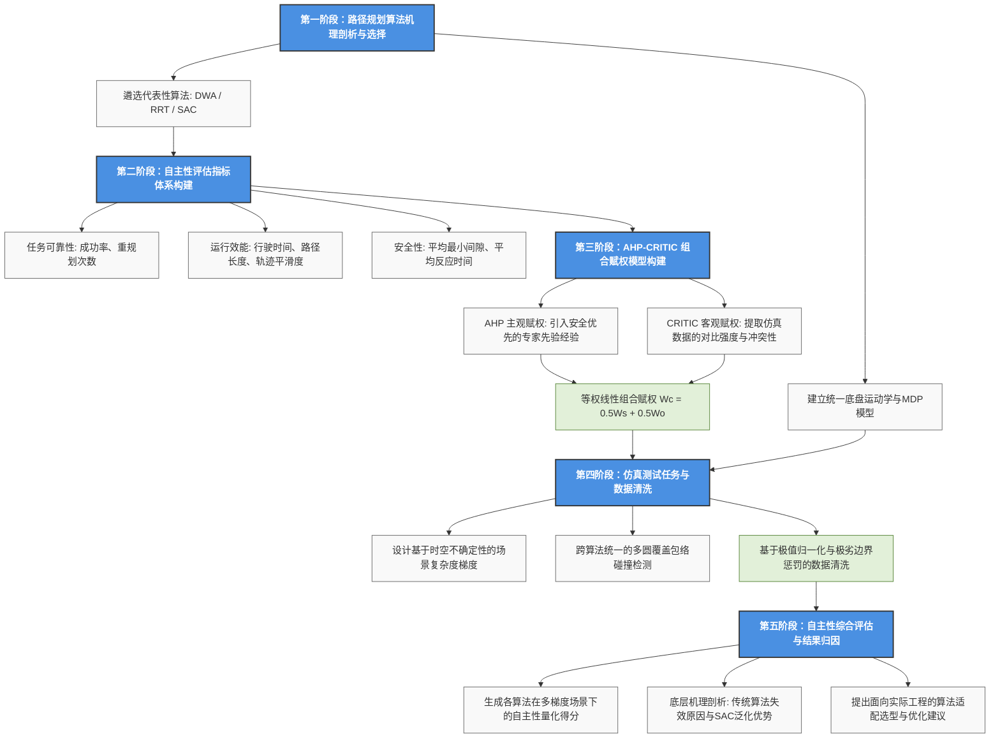

```mermaid
graph TD
    %% 样式定义
    classDef mainNode fill:#4a90e2,stroke:#333,stroke-width:2px,color:#fff,font-weight:bold;
    classDef subNode fill:#f9f9f9,stroke:#666,stroke-width:1px;
    classDef dataNode fill:#e2f0d9,stroke:#548235,stroke-width:1px;

    %% 阶段 1：算法分析与选择
    A[第一阶段：路径规划算法机理剖析与选择]:::mainNode
    A --> A1[建立统一底盘运动学与MDP模型]:::subNode
    A --> A2[遴选代表性算法: DWA / RRT / SAC]:::subNode

    %% 阶段 2：评估体系构建
    A2 --> B[第二阶段：自主性评估指标体系构建]:::mainNode
    B --> B1[任务可靠性: 成功率、重规划次数]:::subNode
    B --> B2[运行效能: 行驶时间、路径长度、轨迹平滑度]:::subNode
    B --> B3[安全性: 平均最小间隙、平均反应时间]:::subNode

    %% 阶段 3：确权与评估模型
    B --> C[第三阶段：AHP-CRITIC 组合赋权模型构建]:::mainNode
    C --> C1[AHP 主观赋权: 引入安全优先的专家先验经验]:::subNode
    C --> C2[CRITIC 客观赋权: 提取仿真数据的对比强度与冲突性]:::subNode
    C1 --> C3[等权线性组合赋权 Wc = 0.5Ws + 0.5Wo]:::dataNode
    C2 --> C3

    %% 阶段 4：仿真测试与清洗
    C3 --> D[第四阶段：仿真测试任务与数据清洗]:::mainNode
    A1 --> D
    D --> D1[设计基于时空不确定性的场景复杂度梯度]:::subNode
    D --> D2[跨算法统一的多圆覆盖包络碰撞检测]:::subNode
    D --> D3[基于极值归一化与极劣边界惩罚的数据清洗]:::dataNode

    %% 阶段 5：综合分析与优化
    D3 --> E[第五阶段：自主性综合评估与结果归因]:::mainNode
    E --> E1[生成各算法在多梯度场景下的自主性量化得分]:::subNode
    E --> E2[底层机理剖析: 传统算法失效原因与SAC泛化优势]:::subNode
    E --> E3[提出面向实际工程的算法适配选型与优化建议]:::subNode
```